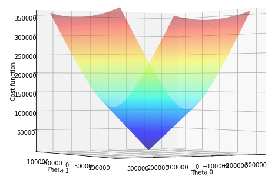

## Multivariate Linear Regression

### [Click here to view the Notebook]([https://github.com/bacon-delight/Multivariate-Linear-Regression/blob/master/Multivariate%20Linear%20Regression.ipynb](https://github.com/bacon-delight/Multivariate-Linear-Regression/blob/master/Multivariate Linear Regression.ipynb))

[Read the article on Medium](https://medium.com/p/74a7ba27fe10)

This repository is intended for a deeper dive into the basics of Linear Regression and will cover the following in details:

- Multivariate Linear Regression
- Feature Normalization
- Cost Function
- Gradient Descent

To learn more about parameter learning and how the gradient descent algorithm works, visit this [link](https://github.com/bacon-delight/machine-learning/blob/master/All%20Files/W01%20-%20C03%20-%20Parameter%20Learning.pdf). If you would like to learn more on the basics of Machine Learning, check out this [repository](https://github.com/bacon-delight/machine-learning). All thanks to Andrew Ng's amazing explanation on Coursera, if you haven't already taken the course, please go ahead and go through it soon.